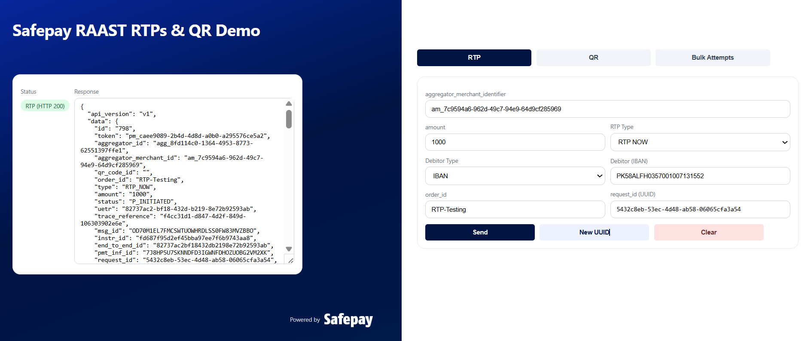
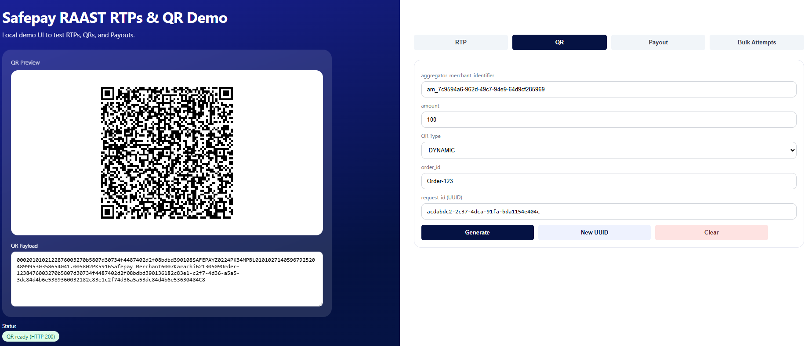

# Safepay RAAST RTP / QR Demo

A local demo UI with a Node.js (Express) backend to test **RAAST RTPs** and **RAAST QR** flows using Safepay’s RAAST APIs.

This project supports:
- **RTP**: `RTP_NOW`, `RTP_LATER`
- **QR**: `DYNAMIC`
- **Bulk Attempts** via CSV / TSV uploads

---

## Prerequisites

```
Node.js 18+
npm
Valid Safepay RAAST Aggregator ID and Secret Key
```

---

## Setup

### 1) Install dependencies

```bash
npm install
```

### 2) Environment variables

```bash
cp .env.example .env
```

Edit `.env` and set your credentials:

```bash
RAAST_AGGREGATOR_ID=agg_xxxxxxxxxxxxxxxxxxxxxxxxxxxxx
RAAST_SECRET_KEY=xxxxxxxxxxxxxxxxxxxxxxxxxxxxx
PORT=3000
```

### 3) Run the server

```bash
npm start
```

Open in browser:

```
http://localhost:3003/raast
```

Health check:

```
http://localhost:3003/health
```

---

## Create RTP

```http
POST /api/rtp
```

```json
{
  "aggregator_merchant_identifier": "am_xxx",
  "amount": 2000,
  "type": "RTP_NOW",
  "order_id": "order-001",
  "request_id": "uuid-v4",
  "debitor_type": "IBAN",
  "debitor_value": "PK10000000000000"
}
```

Supported `debitor_type` values:

```
IBAN
RAAST_ID
VAULT_TOKEN
```

---

## Create QR

```http
POST /api/qr
```

```json
{
  "aggregator_merchant_identifier": "am_xxx",
  "amount": 2000,
  "order_id": "order-qr-001",
  "request_id": "uuid-v4",
  "qr_type": "DYNAMIC"
}
```

The response includes a QR code payload, rendered visually in the UI.

---

## UI Overview

### Tabs

**RTP**
- Form on the right
- Response JSON shown on the left

**QR**
- Form on the right
- QR preview rendered on the left
- Auto-generates once when switching into QR (if fields are valid)
- Press **Generate** to regenerate

**Bulk Attempts**
- Upload + run controls on the right
- Results table rendered on the left

---

## Bulk Attempts (CSV / TSV)

The UI supports **CSV** and **TSV** uploads.  
TSV is recommended when pasting directly from Excel.

---

### Bulk RTP Format  
**File:** `Sample Create Bulk RTPs.csv`

Columns (by position):

```
merchant, amount, type, debitor_type, debitor_value, order_id, request_id(optional)
```

Example:

```
am_xxx,2000,RTP_NOW,IBAN,PK63HABB0011557948316103,rtp-test-1,550e8400-e29b-41d4-a716-446655440000
am_xxx,1500,RTP_LATER,RAAST_ID,03001234567,rtp-test-2
```

---

### Bulk QR Format  
**File:** `Sample Create Bulk QRs.csv`

Columns (by position):

```
merchant, amount, QR, order_id, request_id(optional)
```

Example:

```
am_xxx,2000,QR,qr-test-1,550e8400-e29b-41d4-a716-446655440000
am_xxx,5000,QR,qr-test-2
```

Each successful row renders a QR inside the results table.

---

## Screenshots

### RTP


### QR


### Bulk Attempts


---

## Troubleshooting

### 401 Unauthorized
- Check `RAAST_AGGREGATOR_ID` and `RAAST_SECRET_KEY`
- Ensure `.env` is loaded from the same directory as `server.js`

### QR not rendering
- Confirm QR response contains `code`
- Check browser console for JavaScript errors

### Bulk file not parsed
- Ensure correct column order
- Prefer TSV if Excel formatting causes issues

---

## Security Notes

- `.env` is excluded via `.gitignore`
- Secrets never reach the frontend
- Intended for **local / demo use only**

---

## Project Structure

```text
raast-demo/
├─ public/
│  ├─ css/
│  │  ├─ app.css
│  │  └─ Safepay-White-Logo.png
│  ├─ js/
│  │  ├─ app.js
│  │  ├─ ui.js
│  │  ├─ api.js
│  │  ├─ csv.js
│  │  ├─ qr.js
│  │  └─ helpers/
│  │     ├─ uuid.js
│  │     └─ parseDelimited.js
│  ├─ example csvs/
│  │  ├─ Sample Create Bulk QRs.csv
│  │  └─ Sample Create Bulk RTPs.csv
│  └─ raast.html
├─ server.js
├─ .env.example
├─ package.json
├─ package-lock.json
├─ .gitignore
└─ README.md
```
